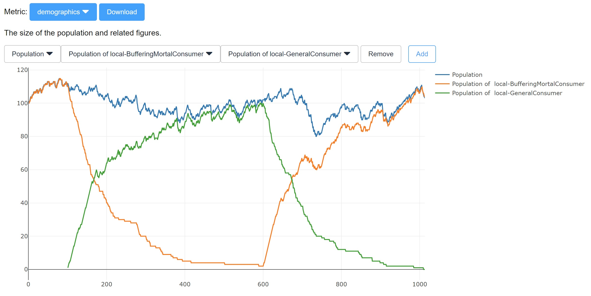
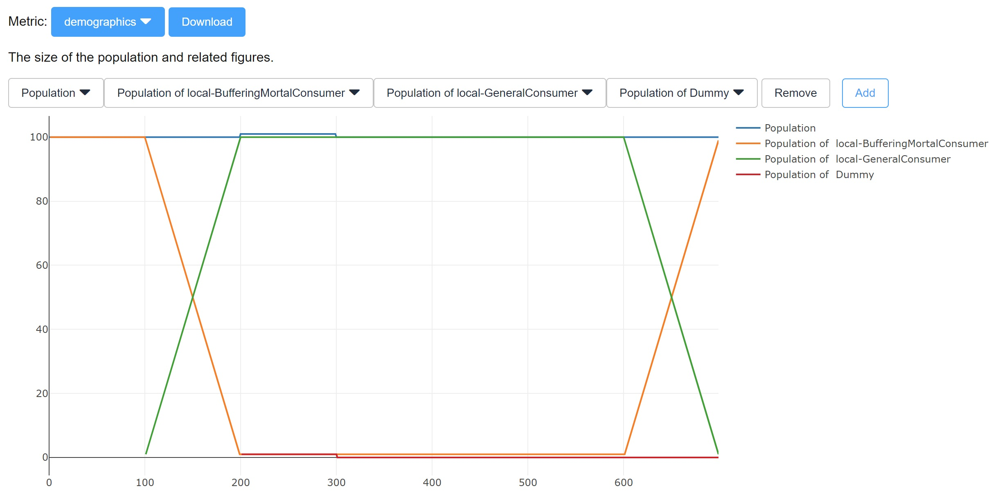

# Exercise 2 - Monetary Economy

## Setting

To move the economy to the next stage, we have introduced farms and money. Instead of working for themselves, the mortal consumers now sell their man-hours on an open market to firms. the firms turn the man-hours into a consumption good (potatoes) and sell them to the consumers. The firms are the price-setters and the consumers the price-takers. The firms iteratively adjust the prices in order to maximize profits. In this settings, the firms are all owned by the central bank, which distributes the profits to the consumers according to a distribution policy. The mortal consumers have a life expectancy of 100 days. When they die, their belongings are evenly distributed to all other consumers.

There are two modes, a competitive mode in which the consumers die randomly with a daily death probability of 1%, and a test mode in which they always live for exactly 100 days. The advantage of the test mode is reduced noise when comparing different strategies. The following screenshots shows how the population can develop in the competitive mode:

Initially, the simulation is filled with 100 background consumers of type BufferingLocalConsumer, and one added every day. The purpose of these is to get the simulation started and to make sure markets are in balance before we add your agents. After day 100, one agent of type [GeneralConsumer](../src/com/agentecon/exercise2/GeneralConsumer.java) is added per day - these are the agents provided by the students. When running the simulation locally, there is only one such type. After having created 500 GeneralConsumers, the background consumers are created again and the simulation ends once the last GeneralConsumer has died. Once can nicely see the exponential decay of that population in the graph.

In the test setting, death is not probabilistic anymore, leading to the completely predictably demographics above. Furthermore, one single extra agent is added. This individual dummy is useful in finding out whether it makes sense for individual agents to deviate from the strategy of the masses. When running this simulation locally, the class [TestConsumer](../src/com/agentecon/exercise2/TestConsumer.java) is used for that agent.

The easiest way to run the simulation locally is to run the [Configuration](../src/com/agentecon/exercise2/Configuration.java) class. It prints out some statistics about the achieved utility and allows you to change the simulation settings. But for the full statistics and charts, you should run (../../Arena/src/com/agentecon/web/SimulationServer.java)

The daily utility function is still the same as the last time, namely:

$U(h_{leisure}, x_{potatoes}) = ln(h_{leisure}) + ln(x_{potatoes})$

Sidenote: the utility function is capped at 0, so the consumer can never experience negative utility. The daily endowment is still 24 man-hours:

$h_{leisure} + h_{work} = 24$

However, the production function of the farms is slightly adjusted for scale. Instead of having one farm per consumer, there are only five farms, but with scaled up production functions. Firm $f$ produces as follows:

$x_{f,potatoes}(x_{land}, h_{work}) = 20 (h_{f}/20-6)^{0.6} x_{land}^{0.2}$

$x_{land}=100$ is still the same. Note that $h_{f}$ contains (at average) the man-hours sold by about 20 consumers. But this is not so important. The consumers are not aware how the production functions of the firms are shaped and only care about the prices they encounter in the market.

## Task 1 - Helicopter Money

The Configuration class allows you to give the TestConsumer a one-time lump sum of money on day 220. Does doing so increase the utility of the TestConsumer? Does doing so have a long-term impact on prices? How about the short-term impact? Are all goods equally affected? 

## Task 2 - Interest

So far, all agents keep a monetary buffer of 20%. That means that they put aside 20% of what they earn and what they already have for the future, spending only 80% of what they could spend each day. The main reason for this is to stabilize the dynamics of the simulation and to smoothen random fluctuations a little. For example, due to being a random simulation, it could happen that the last consumer that enters the market does not find a job anymore as there might be a slightly mismatch between man-hours firms offer to buy and the man-hours the consumers want to sell that day. In such a scenario, having a small buffer allows the consumer to still consumer a little.

Besides smoothening out random noice, the agents had no other incentive so far to keep reserves. However, this changes when we change the distribution mode. Disable helicopter money again and enable the InterestDistribution policy by adding or removing '//' on the according lines in the Configuration class.

Now, the dividends of the firms get distributed proportional to the amount of wealth the consumers have, and it might pay off to hoard money. Note that the underlying economy is still exactly the same, so the efficient equilibrium is still the same. The question is, does the change in the distribution mode change the outcome anyway? And if yes, why is it better or worse than the outcome with equal distribution? Try to find out if there is a "self-confirming equilibrium" in which the TestConsumer has the same behavior as the GeneralConsumer and has no incentive to deviate.

## Task 3 - Competitive Setting

Upload your consumers into your repository and see if you reach a higher score than the other teams. What do you observe? (The grading of this task does not depend on your ranking, but on the observations made.)

## Deadline

The deadline for submitting your agents and the lab journal to github is 2019-10-17 at 24:00. Note that the seminar will not take place on 2019-10-11.
